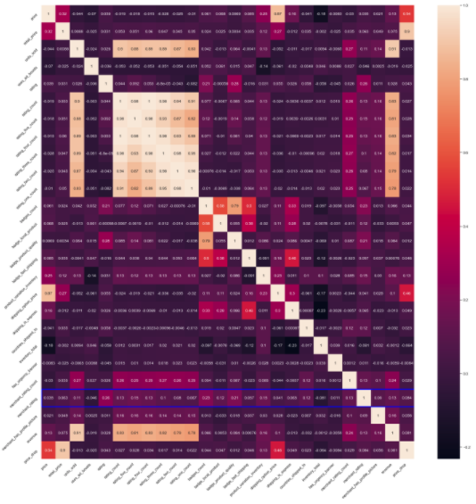

## Next Top Merchant

Through analysis of data we find things that influence rates.  Cleaning of data and visualization of different areas such as  price, revenue, units sold were done.  
See what factors were taking into account inorder to predict Wish top merchants.

## [Index](https://github.com/nanthalec/Wish/blob/master/Wish%20Final%20NB.ipynb)
-  Import Programs and Data
-  Cleaning Data
-  Visualization
-  Tags
-  Visuals in Tableau
-  Liner Regression
-  Corolated Heat Map

 ## Major Factory to increase Merchant Rating are:
 * Rating count
 * Badge count
 * Badge product quantity

 ```
fig_dims = (25, 25)
fig, ax = plt.subplots(figsize=fig_dims)
sns.heatmap(sales.corr(),
            annot=True,
            ax=ax)
ax.add_patch(plt.Rectangle((0,22),31,1, 
                           fill = False, 
                           edgecolor = 'blue', 
                           lw = 3))
plt.xticks(rotation=45, ha='right')
plt.yticks(rotation=45, ha='right')
plt.show()
```




